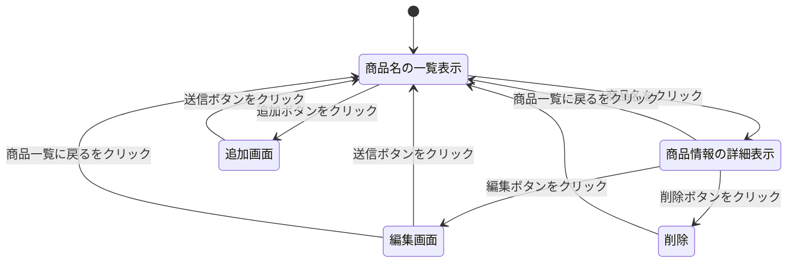
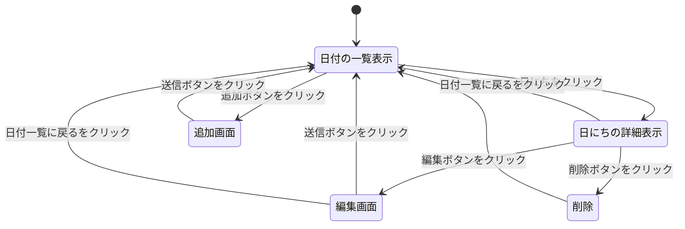
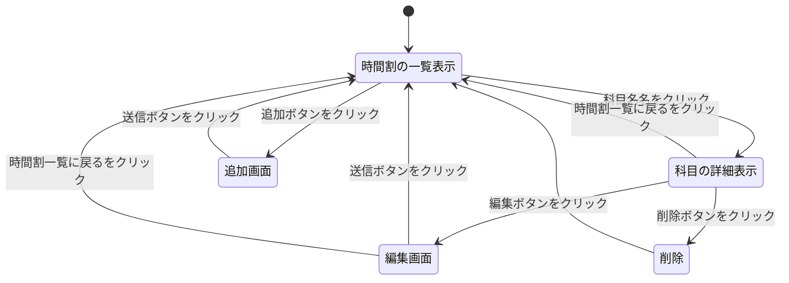
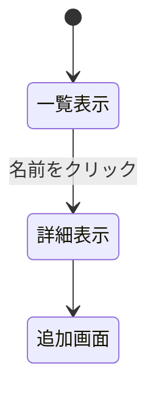

# 開発者仕様書（仮）

## 1. 売り上げ管理システム

### ページ遷移
どのようにページ遷移するのかを図1に示す．

### データ構造

項目名 | 型 | 内容
-|-|-
id | 数値 | 識別コード
code | 文字列 | JANコード
name | 文字列 | 商品名
type | 文字列 | 種類
value | 数値 | 値段
quantity | 数値 | 売上個数

### リソースごとの機能

#### 一覧表示
商品名と画像を表示し，商品名はサイト内リンクを使用する．また，追加ボタンと削除ボタンも設置し，新商品の追加，製造中止商品の削除を行えるようにする．

#### 詳細表示
商品情報についてまとめ，選択している商品以外の商品名と商品一覧へ戻るサイト内リンクを実装する．また，編集ボタンを設置し，商品除法の編集を行えるようにする．

#### 追加画面
商品名を入力するテキストボックスとイメージ画像として使用する画像のファイル名を入力するテキストボックスを設置する．

#### 削除画面
商品の種類の数だけボタンを設置し，削除したい商品を選べるようにする．

###　編集画面
商品の種類の数だけボタンを設置し，編集したい商品を選べるようにする．また，商品情報を入力するテキストボックスを設置する．

## 2. 家計簿システム

### ページ遷移

### データ構造
項目名 | 型 | 内容
-|-|-
id | 数値 | 識別コード
year | 文字列 | 年度
date | 文字列 | 日にち
income | 数値 | 収入
expenditure | 数値 | 支出
commnt | 文字列 | 一言

### リソースごとの機能

#### 月単位での一覧表示
年度と月を一覧で生じしていき，それぞれにサイト内リンクを使用する．また，追加ボタンを設置し，家計簿を何年分でも拡張できるようにする．

#### 月の追加画面
年度を入力するテキストボックスと月を選択する選択ボックスを設置する．

#### 日にち単位での詳細表示
１日ごとの収入と出費を表にして表示する．追加・編集・削除のボタンを設置する．

#### 詳細の追加画面
日にちの選択ボックス，収入・出費の選択ボックス，及びコメントを入力するテキストボックスを設置する．

#### 詳細の編集画面
日にちの選択ボックス，収入・出費の選択ボックス，及びコメントを入力するテキストボックスを設置する．

#### 詳細の削除画面
日にちの選択ボックスを追加する．

## 3. 図書館システム

### ページ遷移
どのようにページ遷移するのかを図3に示す．

### データ構造
項目名 | 型 | 内容
-|-|-
id | 数値 | 識別コード
day | 文字列 | 曜日
subject | 文字列 | 科目名
start | 数値 | 開始時刻
end | 数値 | 終了時刻
test | 文字列 | 試験日

### リソース毎の機能

ページ遷移図の雛形

